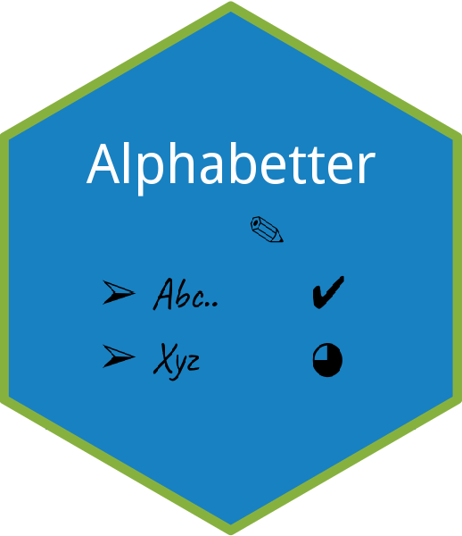

[](https://travis-ci.org/ShaulAb/alphabetter)
[](https://codecov.io/github/ShaulAb/alphabetter?branch=master)

<br><br>


  
<br><br>


## Sorting

Alphabetize code by selecting relevant lines and apply `alpha_sort_addin`.  
Useful for code sections with packages or constants, for example:

```r
library(dplyr)
library(ggplot2)
library(magrittr)
```

This makes it much easier to skim.

<br>


## Listing

Generate a list of all the functions in the script.  
`list_funs_addin` will go over the entire script and generate a sorted list of all the function names.

For example:

```r
# (3 successive lines added by list_funs_addin)
# 1. a()
# 2. b()
# 3. c()

# comment about b
b <- function() { "b" }

# comment about c
c <- function() { "c" }

# comment about a
a <- function() { "a" }
```

<br>

## Code Statistics

Counting code lines, commented lines and blank lines.  
`code_stats_addin` output:

```r
code lines: x
comment lines: y
blank lines: z
code / comments ratio = d.dd ( x / y )
```

<br>

## Notifications

Wip

<br><br>

